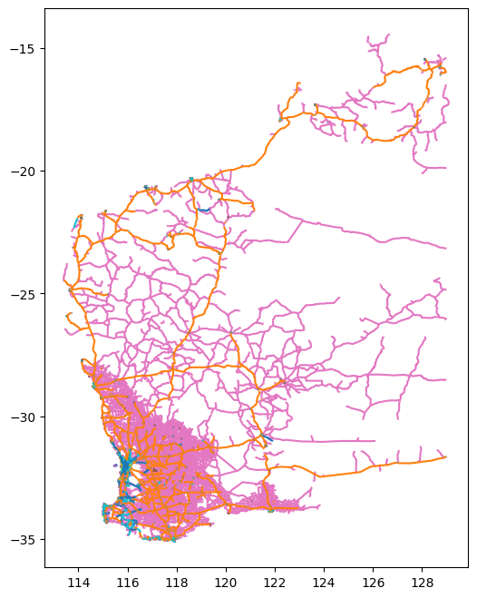

# FetchOpenData <!-- omit in toc -->

A python package containing tools to download data from various open data portals.

- [1. Installation](#1-installation)
- [2. Usage](#2-usage)
  - [2.1. `fetch_road_network_info()`](#21-fetch_road_network_info)
    - [2.1.1. Parameters](#211-parameters)
- [3. Examples](#3-examples)
  - [3.1. Download Main Roads Speed Limit Zones](#31-download-main-roads-speed-limit-zones)

## 1. Installation

Please see [Releases](https://github.com/thehappycheese/fetchopendata/releases) for installation instructions.

Or, to install the main branch please use:

```bash
pip install "https://github.com/thehappycheese/fetchopendata/zipball/main/"
```

## 2. Usage

### 2.1. `fetch_road_network_info()`

Fetches road network data data and returns a `pandas.DataFrame`.

The default source can be found in data portals 
- here: https://portal-mainroads.opendata.arcgis.com/datasets/mainroads::road-network/about
- here: https://data.gov.au/dataset/ds-wa-31cc90e7-2b25-48b7-b855-0ed41996ff50/details?q=
- and here: https://catalogue.data.wa.gov.au/dataset/mrwa-road-network

#### 2.1.1. Parameters

- `url`: str
  - optional
  - specify to override the default
  - default: "https://mrgis.mainroads.wa.gov.au/arcgis/rest/services/OpenData/RoadAssets_DataPortal/MapServer/17/query"
- `chunk_limit`: Optional[int] = None
  - Specify if you wish to limit the number of chunks requested. This can prevent an infinite loop if something goes wrong. Typically the server will respond with chunks of up to 1000 records at a time. Repeated requests are made until all chunks are received.
- `query_params`:Optional[Dict[str, Any]] = None
  - Specify to entirely replace the default query parameters
  - (see more detail at https://developers.arcgis.com/rest/services-reference/enterprise/map-service.htm)
- `additional_query_params`:Optional[Dict[str, Any]] = None
  - Specify to replace only some of the default query parameters
  
```python
# default query parameters if `query_params` is not specified
{
  "where":"1=1",
  "outFields":["ROAD", "START_SLK", "END_SLK", "CWY", "NETWORK_TYPE", "START_TRUE_DIST", "END_TRUE_DIST", "RA_NO"],
  "outSR":4326,
  "f":"json",
  "returnGeometry":False,
}
```

call with default query parameters:

```python
from fetchopendata import fetch_road_network_info
df = fetch_road_network_info()
```

Specify `query_params` to replace all default query parameters:

```python
# this will not use any of the defaults above. This query will fetch all data including geometry; it is not recommended that you do this.
# (I think `"where":"1=1"` is required on all queries?)
df = fetch_road_network_info(
  query_params={
    "where":"1=1",
  }
)
```

Specify `additional_query_params` to replace only some of the default query parameters

```python
df = fetch_road_network_info(
  additional_params={
    "where":"ROAD='H001'",
  }
)
```


## 3. Examples

### 3.1. Download Main Roads Speed Limit Zones

The following example also downloads and converts the geometry into a geopandas dataframe.

If you dont need the spatial geometry, then set `"returnGeometry":False,` and skip the last 4 lines.

```python
#!pip install "https://github.com/thehappycheese/fetchopendata/zipball/main/"

from fetchopendata import fetch_road_network_info
from shapely import MultiLineString
import geopandas as gpd

result = fetch_road_network_info(
    url="https://mrgis.mainroads.wa.gov.au/arcgis/rest/services/OpenData/RoadAssets_DataPortal/MapServer/8/query",
    query_params={
        "where":"1=1",
        "outFields":",".join([
            "ROAD",
            "START_SLK",
            "END_SLK",
            "CWY",
            "NETWORK_TYPE",
            "START_TRUE_DIST",
            "END_TRUE_DIST",
            "RA_NO",
            "SPEED_LIMIT",
            "LG_NO"
        ]),
        "outSR":4326,
        "f":"json",
        "orderByFields":"OBJECTID", # otherwise paging can break :(
        "returnGeometry":True,
    }
)
result=result.rename(columns={"geometry.paths":"geometry"})
result["geometry"] = result["geometry"].apply(MultiLineString)
result = gpd.GeoDataFrame(result)
result.plot(column="SPEED_LIMIT",figsize=(10,10))
```



```python
result[result["ROAD"].str.startswith("H")].sample(3)
```

|       | ROAD | START_SLK | END_SLK | CWY    | NETWORK_TYPE | START_TRUE_DIST | END_TRUE_DIST | RA_NO | SPEED_LIMIT | LG_NO | geometry                                                        |
| ----: | :--- | --------: | ------: | :----- | :----------- | --------------: | ------------: | ----: | :---------- | ----: | :-------------------------------------------------------------- |
| 61369 | H013 |      0.85 |    0.87 | Single | State Road   |            0.85 |          0.87 |    07 | 60km/h      |   129 | MULTILINESTRING ((115.88294799951457 -31.973904999856547, ...)) |
| 66954 | H600 |         0 |    0.15 | Single | State Road   |               0 |          0.15 |    07 | 100km/h     |   131 | MULTILINESTRING ((115.78322599991672 -31.81404599867531, ...))  |
| 61359 | H036 |      3.39 |    7.08 | Single | State Road   |            0.62 |          4.31 |    07 | 60km/h      |   116 | MULTILINESTRING ((115.75205299929262 -32.01611699965741, ...))  |
